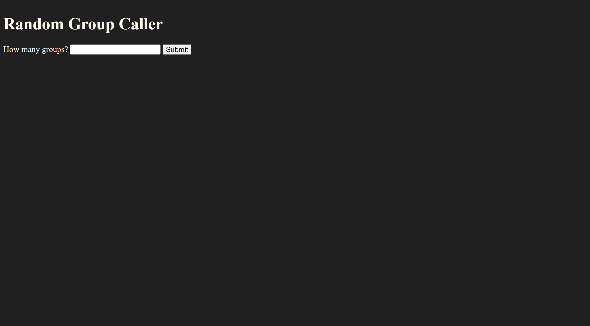
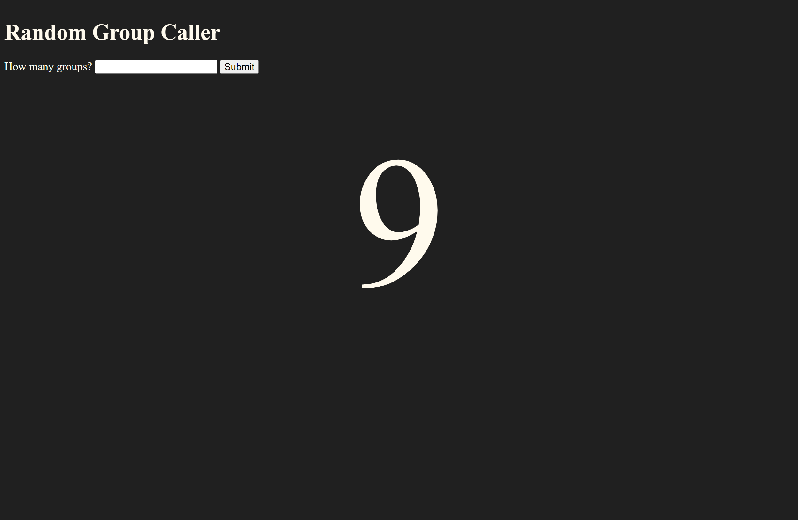

# Random Group Caller

## Table of Contents

* [Description](#description)
* [Links](#links)
* [Screenshots](#screenshots)
* [Usage](#usage)
* [Technologies Used](#technologies-used)
* [Credits](#credits)
* [Contributing](#contributing)
* [Questions](#questions)
* [Badges](#badges)

## Description

This project is a simple JavaScript-based random-number generator for the purpose of randomly calling groups for presentations.

## Links

[Deployed application on GitHub Pages](https://lauracole1900.github.io/group-caller/)

## Screenshots

Landing page:

With a number generated:

## Usage

This project is intended to be used for randomizing which groups get called to present.

## Technologies Used

## Credits

None at this time

## Contributing

N/A

## Questions

If you have further questions, you can reach me at lauracole1900@comcast.net. For more of my work, see [my GitHub](https://github.com/LauraCole1900).

## Badges

